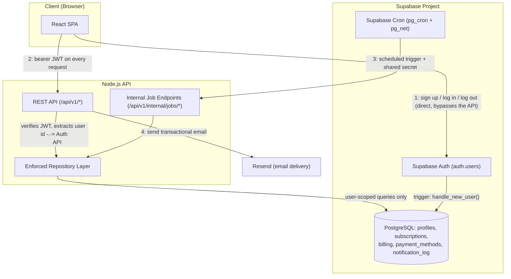

# High-Level Design

## Subscription Manager

Ties together every decision in `docs/architecture/decisions.md`, `data-model.md`, `database-design.md`, and `api-design.md` into one system picture.

---

## System Boundaries

**Owned by this system** (what you'd actually deploy):
* **React SPA** — the frontend, client-side only, no server-side rendering.
* **Node.js API** — all business logic, validation, and the enforced repository layer. The single point of server-side authorization (FR-005).

**Depended on, not owned:**
* **Supabase Auth** — owns identity/credentials entirely; the SPA talks to it directly for sign-up/login/logout, never through the Node API.
* **Supabase Postgres** — the single source of truth for all app data, reachable *only* through the Node API's repository layer (never directly from the SPA).
* **Supabase Cron** (`pg_cron`/`pg_net`) — the sole trigger for scheduled work; owns no business logic itself.
* **Resend** — email delivery only; the Node API decides what to send and when.

**Explicitly out of scope** (per the PRD's Non-Goals): the actual subscription providers (Netflix, etc. — only their links are stored, never integrated with), any payment processor (payment method *type* is recorded, never processed or charged).

---

## Component Diagram

The one intentional asymmetry: the SPA has *two* backends it talks to — Supabase Auth directly for identity, and the Node API for everything else. It never reaches Postgres directly. That split is what keeps the Node API as the single enforcement point (FR-005) instead of splitting authorization logic between Supabase's autogenerated data API and a custom one.

---

## Request Flow: Create Subscription

1. User submits "Add Subscription" in the SPA.
2. SPA calls `POST /api/v1/subscriptions` with `Authorization: Bearer <token>`.
3. API middleware verifies the Supabase JWT, extracts `userId` — never trusted from the request body.
4. Service layer validates (`cost > 0` — BR-011; `billingPeriod` required/absent per `subscriptionType` — BR-017) → repository layer inserts the `subscriptions` row and the first `billing` row, both scoped to `userId`.
5. Service layer records + sends a "subscription created" email via Resend, guarded by `notification_log`.
6. API returns `201` with the created subscription.

## Request Flow: Scheduled Overdue Sweep

1. Supabase Cron fires `POST /api/v1/internal/jobs/transition-overdue` daily.
2. Internal-endpoint middleware checks `X-Internal-Job-Secret` — a structurally separate path from user-JWT auth, not just an endpoint ordinary users happen not to know about.
3. A repository function explicitly marked cross-user (no `userId` parameter) scans `billing` for lapsed rows across *every* user — the one deliberate exception to "every query is user-scoped" (`database-design.md`).
4. For each lapsed subscription: `subscriptions.status → active-unknown`, and the matching `billing` row's `status → due` (the one mutation the immutability trigger permits).
5. Status-change emails sent via Resend, deduped through `notification_log`.

---

## What This Diagram Deliberately Leaves Out

Hosting/deployment topology (still an open decision — see `readme.md`'s Decision Log) and observability tooling aren't shown here, since neither is decided yet. This diagram describes the logical components and their relationships, not where each one physically runs.
